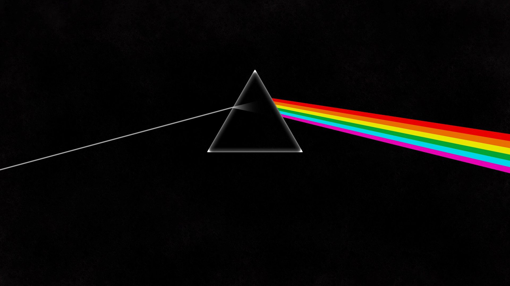

<!DOCTYPE html>
 <html lang="en-us">
 <!---------HEAD(TITLE)-------->
 <head>
     <title>HOME | Shubham Sharma</title>
     <meta charset="UTF-8">
     <meta name="keywords" content="HTML, CSS, JavaScript">
     <meta http-equiv="refresh" content="120">
     <meta name="viewport" content="width=device-width, initial-scale=1.0">
 </head>
 <!----------BODY-------------->
 <body id="BackOnTop" style="background-color:black;text-align:center;">
     

         <!---------------------------------------------------
         ---------------GIANNIS IMAGE-------------------------
         ---------------------------------------------------->
         <iframe src="https://giphy.com/embed/LMPoJJ7m1nxlRbswAt" max-width="150" height="150" title="HI !" frameBorder="0" class="giphy-embed" allowFullScreen></iframe>
<a href="https://giphy.com/gifs/bucks-nba-milwaukee-giannis-antetokounmpo-LMPoJJ7m1nxlRbswAt">via GIPHY</a>

         <!---------------------------------------------------
         -----------------HEADING 1---------------------------
         ---------------------------------------------------->
         <h1 style="color:antiquewhite;"><b><i><abbr title="Hyper Text Markup Language">HTML</abbr></i></b> <bdo dir="rtl">page</bdo> made by</h1>
         <h1 style="color:yellow; font-size:300%; font-family:Verdana;"><i><ins>$HUBHAM</ins> <ins>$HARMA</ins></i></h1>
         <a href="#CSS" style="color:orange;"><b style="font-size:20px;">~ Click here to know the types of CSS.</b></a>
           
         <a href="Internal_CSS.html#Icss" target="_blank" style="color:orange;"><b style="font-size:20px;">~ Open Internal CSS.</b></a>
           
         <a href="htmlforms.html" target="_blank" title="FORMS" style="color:orange;"><b style="font-size:20px;">~ Open HTML Forms.</b></a>
           

 
         <!---------------------------------------------------
         -----------------PARAGRAPH 1-------------------------
         ---------------------------------------------------->
         
Hello i am Shubham Sharma,<mark><b><i> a 21 years old full stack developer. </i></b></mark>

         <pre style="color:white;" title="CHEF CURRY"><i><b>First name <mark> Stephen </mark>
         last name <mark> Curry </mark>
         he came into my life,
         and everything's less worry.</b></i></pre>
         <!---------------------------------------------------
         ---------------GITHUB IMAGE--------------------------
         ---------------------------------------------------->
         
<del><b>Below is the link of my Github profile you can check it out.</b></del>

         
         <!---------------------------------------------------
         ---------------GMAIL IMAGE---------------------------
         ---------------------------------------------------->
         
<b>Mail me at the below link.</b>

           
         
  
         <!---------------------------------------------------
         ----------------------VIDEO--------------------------
         ---------------------------------------------------->
         <video controls>
             <source src="movie.mp4">
         </video>   
         <iframe width="560" height="315" src="https://www.youtube.com/embed/bBHj1djGMxU" title="YouTube video player" frameborder="0" allow="accelerometer; autoplay; 
         clipboard-write; encrypted-media; gyroscope; picture-in-picture" allowfullscreen></iframe>
            
 
         <!---------------------------------------------------
         ------------PINK FLOYD IMAGE-------------------------
         ---------------------------------------------------->
         <figure>
         <figcaption style="color:white;">PINK FLOYD - THE WALL (Fig. Cap.)</figcaption>
         </figure>
           
         
PINK FLOYD

         <blockquote style="color:yellow; text-align: left; border:6px solid red;padding: 30px;background-color: green;">
             Now Pink Floyd have received an accolade to match the enormity of their sound and performances - by being named the biggest band of all time,
             ahead of acts such as Led Zeppelin and the Rolling Stones.They were famed for their 20-minute opuses and grandiose stadium shows featuring flying pigs.
         </blockquote>
         <!----------------------------------------------------
         -----------------SPOTIFY IMAGE------------------------
         ----------------------------------------------------->
          
           

         <!----------------------------------------------------
         -----------------POP-UP ALERT-------------------------
         ----------------------------------------------------->
         
         <!------------------------------------------------------
         -----------------PLAYER'S FACE--------------------------
         ------------------------------------------------------->
         
<b>Click on the player's face to know about them</b>
 
           
         <!------------------------------------------------------
         ---------------------NBA--------------------------------
         ------------------------------------------------------->
         
         <map name="nba">
             <area shape="rect" coords="391,227,262,8" href="davis.html" target="_blank">
             <area shape="rect" coords="121,200,242,446" href="bosh.html" target="_blank">
             <area shape="rect" coords="98,484,228,716" href="wade.html" target="_blank">
             <area shape="rect" coords="328,489,462,718" href="kyrie.html" target="_blank">
             <area shape="rect" coords="349,233,483,462" href="lebron.html" target="_blank">
             <area shape="rect" coords="861,45,984,267" href="draymond.html" target="_blank">
             <area shape="rect" coords="734,224,865,445" href="durant.html" target="_blank">
             <area shape="rect" coords="987,260,1118,481" href="klay.html" target="_blank">
             <area shape="rect" coords="970,497,1110,697" href="westbrook.html" target="_blank">
             <area shape="rect" coords="738,489,869,710" href="curry.html" target="_blank">
         </map>
            
  
      </body>
  </html>
